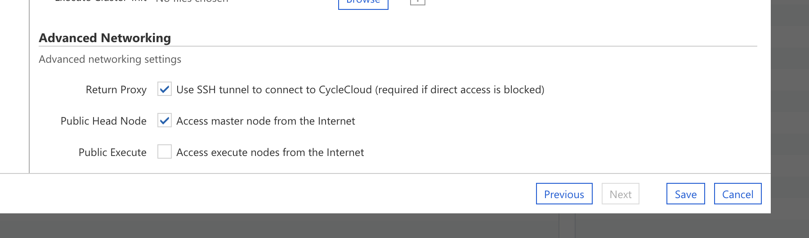
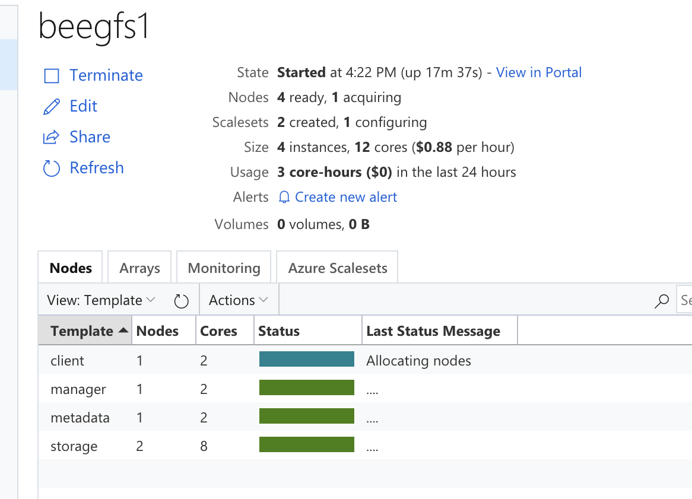
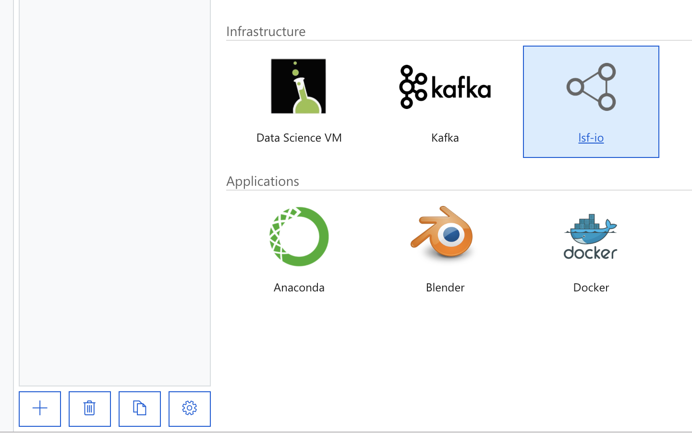

# Overview

This lab walks through setting up a BeeGFS cluster in Azure and attaching a LSF compute cluster. These clusters will be managed by Azure CycleCloud running in an Azure Container Instance.

The LSF cluster will be running a parallel IO benchmarking utility, which is critical
to designing and maintaining filesystems for performance.


# Objectives

This is a technical lab to help you use Azure CycleCloud to create, use, and manage a EDA industry HPC scenario.  I this lab you will:

* Launch CycleCloud in an Azure Container Instance
* Configure CycleCloud to use Azure credentials (Service Principal)
* Configure a command line environment to configure CycleCloud in Azure Cloud.Shell
* Stage the LSF community project and the local IO benchmarking project into the locker.
* Create a Vnet and a BeeGFS storage cluster in CycleCloud.
* Add a LSF cluster with IO benchmarking toosl to the environment and mount the BeeGFS cluster.
* Create files, perform I/O tests on the BeeGFS parallel file system.

# Lab Content

This lab relies heavily on a bash environment and will be assuming availability of the `az` cli either in Cloud.Shell or another bash environment.

### Prerequisites

 * ~25 vCPU available quota of Ds_v3
 * Contributor role access to subscription
 * Azure Portal login

## 1. Starting CycleCloud

Use the `az` cli to create a resource group for this HOL in southeastasia and launch a container running CycleCloud:

    az group create -l southeastasia -n ${ResourceGroup}

Then launch Azure CycleCloud as a container instance in the resource group, more
documentation is availabile in the CycleCloud [documentation](https://docs.microsoft.com/en-us/azure/cyclecloud/container-distribution):

    az container create -g ${ResourceGroup} --location southeastasia --name ${InstanceName} --dns-name-label ${InstanceDNS} --image mcr.microsoft.com/hpc/azure-cyclecloud:latest --ip-address public --ports 80 443 --cpu 2 --memory 4 -e JAVA_HEAP_SIZE=2048

This will take about 5 minutes for the container to come up, pull the image and start CycleCloud. After this time CycleCloud will be available at the container url:

    https://{InstanceDNS}.southeastasia.azurecontainer.io

## 2. Configure CycleCloud Admin User and Service Principal

Now that you're able to access the CycleCloud UI, configure the admin user by following the docs:

https://docs.microsoft.com/en-us/azure/cyclecloud/installation#configuration

Note the login and password used, we'll refer to this user as the CC admin user.

In the next step in the CycleCloud Setup menu, you'll be asked for the service principal data.
Create the service principal in the cloud shell with the following command:

    az ad sp create-for-rbac --name CycleCloudApp --years 1

More context can be found in the CycleCloud docs here: https://docs.microsoft.com/en-us/azure/cyclecloud/quickstart-install-cyclecloud#service-principal


## 3. Configuring CycleCloud using the CycleCloud CLI in the Cloud.Shell

Adding new projects to CycleCloud and connecting to running clusters is done by using the command line tools. Each CycleCloud instance hosts the CLI tools in the web portal.  

```bash
wget --no-check-certificate https://${InstanceDNS}.southeastasia.azurecontainer.io/download/tools/cyclecloud-cli.zip
unzip cyclecloud-cli.zip
cyclecloud-cli-installer/install.sh
export PATH=$PATH:~/bin
cyclecloud
```

These commands download, unzip, install and set required environment variable to use the cyclecloud cli.
Configure the cli for access to CycleCloud and setup your account with the command line and your service principal details.

Here we use the same ResourceGroup as defined when creating the Azure Container Instance. 

```bash
michael@Azure:~$ cyclecloud config create hol
CycleServer URL: https://mikeholdemo-cc.southeastasia.azurecontainer.io
Detected untrusted certificate.  Allow?: [no] yes
/home/michael/.cycle/cli/local/lib/python2.7/site-packages/requests/packages/urllib3/connectionpool.py:734: InsecureRequestWarning: Unverified HTTPS request is being made. Adding certificate verification is strongly advised. See: https://urllib3.readthedocs.org/en/latest/security.html
  InsecureRequestWarning)
CycleServer username: [admin] admin
CycleServer password:
/home/michael/.cycle/cli/local/lib/python2.7/site-packages/requests/packages/urllib3/connectionpool.py:734: InsecureRequestWarning: Unverified HTTPS request is being made. Adding certificate verification is strongly advised. See: https://urllib3.readthedocs.org/en/latest/security.html
  InsecureRequestWarning)

Generating CycleServer key...
First, we need a name for your cloud account. This can be anything that identifies the account (e.g., dev or prod).
Note: this cannot be changed later.
Account Name: azure
Your Azure cloud environment
Cloud Environment: public
Your Azure tenant ID can be found when you run 'azure account list'.
Tenant ID: XXXXXXXX-XXXX-XXXX-XXXX-XXXXXXXXXX 
Your Azure CycleCloud application ID from Azure portal. (Active Directory->App Registrations).
Application ID: XXXXXXXX-XXXX-XXXX-XXXX-XXXXXXXXXX
The Azure CycleCloud application secret generated from Azure portal. (Active Directory->App Registrations)
Application Secret:
In order to administer the cloud account we need credentials to authenticate to Azure.
Subscription ID: XXXXXXXX-XXXX-XXXX-XXXX-XXXXXXXXXX
Default data center location to use when not specified by a cluster.
Default Location: southeastasia
Azure default region has been set to southeastasia
If specified, all Azure resources will be created in this resource group. Otherwise, a new resource group will be created per cluster
Resource Group: mikeholdemo
We need a place to store various data such as cluster coordination information.
This storage account will be created for you if it does not already exist.
Storage Account: mikeholdemostor
This storage account does not exist yet.
Create storage account? [n] y
Finally, we need a container in the storage account to store various data.
This storage container will be created for you if it does not already exist.
Storage Container: [cyclecloud]
```

The last step to setup your admin user is to provide CycleCloud with a public ssh key for the account.

If you don't already have an ssh key in your Cloud.Shell, create one with `ssh-keygen` and follow the instructions.  If you do, get the public key with `cat ~/.ssh/id_rsa.pub`.  

Copy the contents of the file and save them into your CycleCloud user profile.

 1. Click your username in the upper right hand corner.
 1. Select "My Profile" in the drop down.
 1. Select "Edit Profile" and paste the public key into the _SSH Public Key_ field.

## 4. Configure pogo to access the cyclecloud storage locker

We will be uploading project data into the cyclecloud storage locker specific to this lab. So we need to configure access to the locker we created.  To get the locker details:

    $ cyclecloud locker list
    azure-storage (az://mikeholdemostor/cyclecloud)

This command shows the shorthand of the storage locker.  To continue, get the access key to the storage locker in the portal, and run `pogo config`.

```bash
$ pogo config
Re-initializing. (Note: Current settings may be modified.)
Would you like to add another pogo configuration section (y/n)? [n] y

Please provide a name to refer to this set of options.
Section Name: hol-demo
You may enter a url or urls which this section is to be limited to.  The list should be comma separated.
URL(s): (optional) az://mikeholdemostor/cyclecloud
Storage Account Access Key:
```
When prompted provide the URL, and Access key, and don't enable additional encryption for simplicity.


## 5. Launch a BeeGFS cluster with the default settings.

We'll launch BeeGFS cluster with the default settings in CycleCloud.  Select the BeeGFS cluster type in the CycleCloud menu.  


We're going to use the default settings, all of which are chosen by default. One setting that might not work by default is the Subnet, which is specific to each subscription.


If there are no subnets in the dropdown, then create a vnet and subnet in the region using the azure portal or cli.  CycleCloud can take as long as 10 minutes to register new subnets in the UI.. if your new subnet isn't appearing in the dropdown, just wait a few minutes.



We'll be giving the BeeGFS manager node a public IP address so that we can connect and interact with the cluster.

Save the Cluster and Start it!

The cluster will move through the starting phases for each node.  


There may be some _Node software installation failure_ messages, but these are likely 
transient errors due to the storage daemons waiting for the management and metadata daemons to be started.

Once the cluster is fully started, add a client node for interacting with the file system:

    cyclecloud add_node beegfs1 -t client

When the client node "turns green" and has entered the _started_ state, you can connect to it using the `cyclecloud connect` command.

```bash
~$ export PATH=$PATH:~/bin
~$ cyclecloud connect client-1 -c beegfs1
Connecting to admin@10.0.0.8 (instance ID: 59dcc214a941659ac8467d83e9e7c717) through SSH bastion at admin@13.76.192.51
Warning: Permanently added '10.0.0.8' (ECDSA) to the list of known hosts.

 __        __  |    ___       __  |    __         __|
(___ (__| (___ |_, (__/_     (___ |_, (__) (__(_ (__|
        |

Cluster: beegfs1
Version: 7.6.1
Run List: recipe[cyclecloud], recipe[beegfs::client], recipe[cganglia::client], recipe[cluster_init]
$ df | grep beegfs
beegfs_nodev   4227284992  692224 4226592768   1% /mnt/beegfs
```
The `df` command shows that there is a 4TB parallel storage cluster mounted to the client 
at _/mnt/beegfs_. This client is an example of what we will do with a
full scheduler environment.  I.e. mount the parallel file system in the next steps.




## 4. Add the LSF and IO Benchmark Projects to CycleCloud

We now move to setting up the IO benchmark cluster which will run LSF and IOR benchmark. The configuration for these two softwares are in two different projects.  We will add the projects to CycleCloud.

### Add the LSF project to CycleCloud

The below script shows how to gather all the artifacts needed to launch an LSF
cluster in CycleCloud.

1. Clone the _cyclecloud-lsf_ repository.
1. Fetch the lsf installer and binaries using pogo.
1. Upload the project to the CycleCloud Locker.

```bash
git clone https://github.com/Azure/cyclecloud-lsf.git
cd cyclecloud-lsf/blobs
pogo get az://requawestus2/public/lsf10.1_linux2.6-glibc2.3-x86_64.tar.Z
pogo get az://requawestus2/public/lsf10.1_lsfinstall_linux_x86_64.tar.Z
cyclecloud project upload my-locker
```

---
**NOTE**

 If you don't remember your locker name, use the `cyclecloud locker list` command to find it.

---


### Add the IO project to CycleCloud

Contained in this repo is a project called _io_ which contains installation on an io benchmarking 
tool.  There are two steps to add the project to CycleCloud.

1. Clone the _HOL_ repository.
1. Change directory into the _io_project directory and upload.

```bash
git clone <my-repo>
cd projects/io
cyclecloud project upload my-locker
```

## 4. Configure and create LSF Cluster

The [lsf cluster template file](templates/lsf.txt) in this repo contains most of
the necessary configuration to run the IO benchmarking tools.  What's missing 
are only details about the VNet being used.  These can be entered in the UI.

### Import the LSF template with BeeGFS clients

Import the lsf cluster template file into cyclecloud as a cluster template.

```bash
cyclecloud import_cluster lsf-io -c lsf -f templates/lsf.txt -t
```

Then we can make the final configurations in UI.  

### Create a new LSF cluster in the UI

In the main clusters page, find the _+_ button to add a new cluster to your management list.
Find the _lsf-io_ cluster type that you've just imported, this will take you to the configuration menus.



When configuring the cluster, make sure to put it in the same Vnet as the BeeGFS
cluster so that the LSF cluster can properly mount the filesystem.

---
**NOTE**

 Don't uncheck the Return Proxy checkbox or set an Access Subnet.  We need to open a proxy so we can connect from the Cloud.Shell

---


One more key configuration is to add the io project to the cluster.  In the Advanced menu, find the master and 
execute cluster-inits.  Select one for each, the io:1.0.0:default for the master and io:1.0.0:exec for the execute
The menu is browsing the contents of the locker.  These io packages are installing 
the FIO software including mpich.


Once the configurations are saved, you can _start_ the cluster.  The master nodes can take
10 minutes to start.  It is sometimes interesting to log into the master node and 
tail the provisioning log.  

```bash
cyclecloud connect master-1 -c lsf1

sudo tail -f /opt/cycle/jetpack/logs/chef-client.log

[2019-01-15T02:07:20+00:00] INFO: Posted converge history report
[2019-01-15T02:07:20+00:00] INFO: ---- PROFILER DATA ----
[2019-01-15T02:07:20+00:00] INFO:  1312.416230 cluster_init::jetpack
[2019-01-15T02:07:20+00:00] INFO:   112.943996 beegfs::client
[2019-01-15T02:07:20+00:00] INFO:    16.087045 beegfs::default
[2019-01-15T02:07:20+00:00] INFO:     2.722030 cvolume::default
[2019-01-15T02:07:20+00:00] INFO:     1.258627 cganglia::_linux
[2019-01-15T02:07:20+00:00] INFO:     0.503362 lsf::master
```

You'll see the lsf, beegfs, and io software installations run. Note that the
mpich and ior installer take some time to compile and build.

## 5. Run the IO Benchmark jobs

As the admin user you can submit the io benchmark job.  Login to a master node
and submit the job 2x.

```bash
bsub < /shared/scratch/bench.sub
bsub < /shared/scratch/bench.sub
```

---
**NOTE**

 Submit the same job twice! We need to trick the scheduler.

---

Reading the job file, you can see the IO summary in the job output.